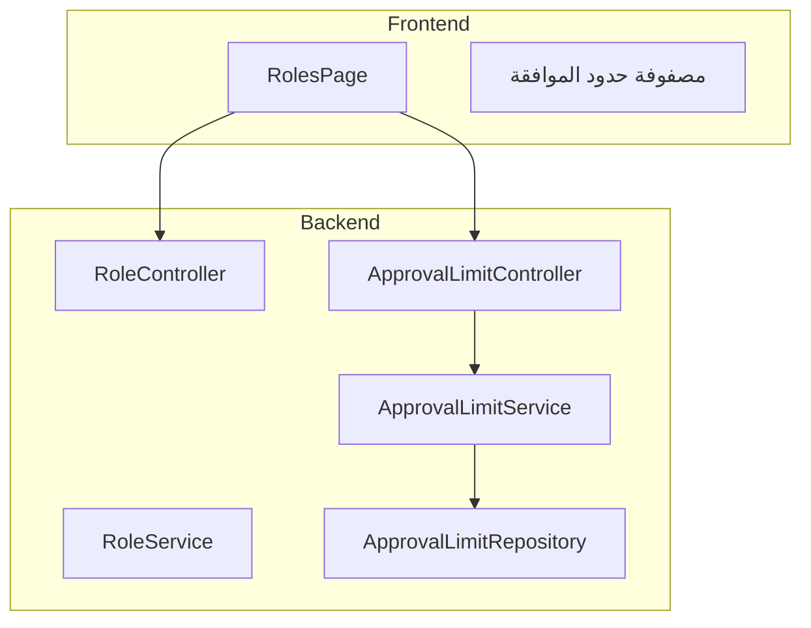

# خطة محاذاة صفحة الأدوار مع الدورة المستندية

## ما هو موجود وجاهز في النظام

- **صفحة الأدوار** [RolesPage.tsx](web/frontend/src/pages/settings/RolesPage.tsx): إدارة الأدوار (CRUD) وتعيين صلاحيات الأقسام (SECTION_*) عبر `PermissionMatrix`.
- **حدود الموافقة** في قاعدة البيانات: كيان `ApprovalLimit` وجدول `approvallimits` مع بيانات مُهيأة في [DataSeeder.seedApprovalLimits](web/backend/src/main/java/com/rasras/erp/user/DataSeeder.java) للنشاطات: `PO_APPROVAL`, `PAYMENT_APPROVAL`, `SALES_DISCOUNT`.
- **استخدام الحدود في المنطق**: `ApprovalService` (أوامر الشراء) و `SupplierInvoiceService` (اعتماد صرف فواتير المورد) يعتمدان على حدود الموافقة.
- **الدورة المستندية** [doc/الدورة_المستندية_الشاملة.md](doc/الدورة_المستندية_الشاملة.md): توثيق الهيكل التنظيمي، مصفوفة الصلاحيات، وصلاحيات كل قسم.
- **الأدوار الحالية**: ADMIN, GM, FM, ACC, PM, BUYER, SM.

---

## ما هو ناقص ويجب تنفيذه

| البند                      | الوضع الحالي                              | المطلوب                                                      |
| -------------------------- | ----------------------------------------- | ------------------------------------------------------------ |
| مصفوفة حدود الموافقة       | مخزنة في DB، غير معروضة ولا قابلة للتعديل | عرض وتعديل من الواجهة                                        |
| API حدود الموافقة          | لا يوجد                                   | إضافة REST endpoints للقراءة والتحديث                        |
| ربط الأدوار بحدود الاعتماد | غير ظاهر في صفحة الأدوار                  | عرض حدود كل دور وعرض علاقة الدور بخطوات سير العمل            |
| صندوق المرجع في RolesPage  | يشرح ربط الأقسام بالأدوار فقط             | تحديث ليتوافق مع الدورة المستندية ويضيف إشارة لمصفوفة الحدود |

---

## الهيكل المقترح (Best Practices)

- **فصل المسؤوليات**: صلاحيات الأقسام (Section Permissions) تبقى في `/roles/{id}/permissions`، حدود الموافقة (Approval Limits) تدار عبر `/approval-limits`.
- **عرض موحد**: مصفوفة الحدود تُعرض ضمن صفحة الأدوار (أو كتبويب/قسم متميز) لتكون كل الإعدادات ذات الصلة بالأدوار في مكان واحد.

---

## التنفيذ المقترح

### 1. Backend: Approval Limit API

**ملفات جديدة/معدلة:**

- إنشاء [ApprovalLimitDto](web/backend/src/main/java/com/rasras/erp/approval/dto/ApprovalLimitDto.java): حقول id, activityType, roleId, roleCode, roleNameAr, minAmount, maxAmount, minPercentage, maxPercentage, isActive.
- إنشاء [ApprovalLimitService](web/backend/src/main/java/com/rasras/erp/approval/ApprovalLimitService.java):
  - `getAllLimits()` أو `getLimitsByActivityType(activityType)`.
  - `getLimitsByRole(roleId)`.
  - `updateLimit(id, dto)` لتعديل min/max و isActive فقط (دون تغيير الدور أو النشاط).
- إنشاء [ApprovalLimitController](web/backend/src/main/java/com/rasras/erp/approval/ApprovalLimitController.java):
  - `GET /approval-limits` مع `?activityType=` اختياري.
  - `GET /approval-limits/role/{roleId}`.
  - `PUT /approval-limits/{id}`.

**Repository:** إضافة `List<ApprovalLimit> findByRole_RoleId(Integer roleId)` في [ApprovalLimitRepository](web/backend/src/main/java/com/rasras/erp/approval/ApprovalLimitRepository.java) إن لم يكن موجوداً.

---

### 2. Frontend: خدمة وواجهة حدود الموافقة

- إنشاء [approvalLimitService.ts](web/frontend/src/services/approvalLimitService.ts): استدعاءات API (getAll, getByRole, update).
- واجهات TypeScript: `ApprovalLimitDto` مطابقة لـ DTO في الـ backend.

---

### 3. إثراء صفحة الأدوار (RolesPage)

- **قسم جديد "مصفوفة حدود الموافقة"** داخل [RolesPage.tsx](web/frontend/src/pages/settings/RolesPage.tsx):
  - جدول يعرض الحدود حسب النشاط (موافقة المشتريات، اعتماد الدفع، خصم المبيعات).
  - أعمدة: النشاط، الدور، الحد الأدنى، الحد الأقصى، نشط، إجراء (تعديل).
  - استبدال النص "بلا حد" عندما يكون `maxAmount` أو `maxPercentage` null.
- **مودال تعديل حد واحد**: حقول min/max (مبلغ أو نسبة حسب النشاط)، مفتاح تفعيل/تعطيل.
- **عند عرض/تعديل دور**:
  - عرض الحدود المرتبطة بهذا الدور (إن وُجدت) داخل مودال "إدارة الصلاحيات" أو في قسم منفصل في البطاقة.
  - تنبيه عند الحذف: "هذا الدور مستخدم في حدود الموافقة وسير العمل" (الرسالة موجودة في الـ backend بالفعل).
- **تحديث صندوق المرجع**:
  - توضيح أن الأدوار تحكم وصول الأقسام (القوائم) وحدود الاعتماد المالية.
  - إضافة إحالة إلى الدورة المستندية ووصف مختصر لمصفوفة الصلاحيات كما في المستند.

---

### 4. محاذاة المحتوى مع المستند

- مراجعة وصف الأدوار في الصفحة والتأكد من توافقها مع الدورة المستندية (GM, FM, ACC, PM, SM, ...).
- استخدام التسميات العربية من المستند: "موافقة على المشتريات"، "اعتماد صرف فواتير الموردين"، "خصم المبيعات".

---

### 5. أدوار إضافية (اختياري)

- إضافة أدوار **WH** (أمين المخزن) و **QC** (الجودة) في [DataSeeder.seedRoles](web/backend/src/main/java/com/rasras/erp/user/DataSeeder.java) إن رغبت الشركة بتطبيقها في الواجهة وصلاحيات الأقسام.

---

## ملخص الملفات المتأثرة

| الملف                          | الإجراء                                                   |
| ------------------------------ | --------------------------------------------------------- |
| `ApprovalLimitDto.java`        | إنشاء                                                     |
| `ApprovalLimitService.java`    | إنشاء                                                     |
| `ApprovalLimitController.java` | إنشاء                                                     |
| `ApprovalLimitRepository.java` | إضافة `findByRole_RoleId` إن لزم                          |
| `approvalLimitService.ts`      | إنشاء                                                     |
| `RolesPage.tsx`                | إضافة قسم مصفوفة الحدود، مودال تعديل، وتحديث صندوق المرجع |

---

## ترتيب التنفيذ

1. Backend: DTO، Service، Controller، وRepository.
2. Frontend: `approvalLimitService.ts`.
3. إضافة قسم "مصفوفة حدود الموافقة" ومودال التعديل في RolesPage.
4. تحديث صندوق المرجع وإحالة الدورة المستندية.
5. (اختياري) إضافة أدوار WH و QC في DataSeeder.

